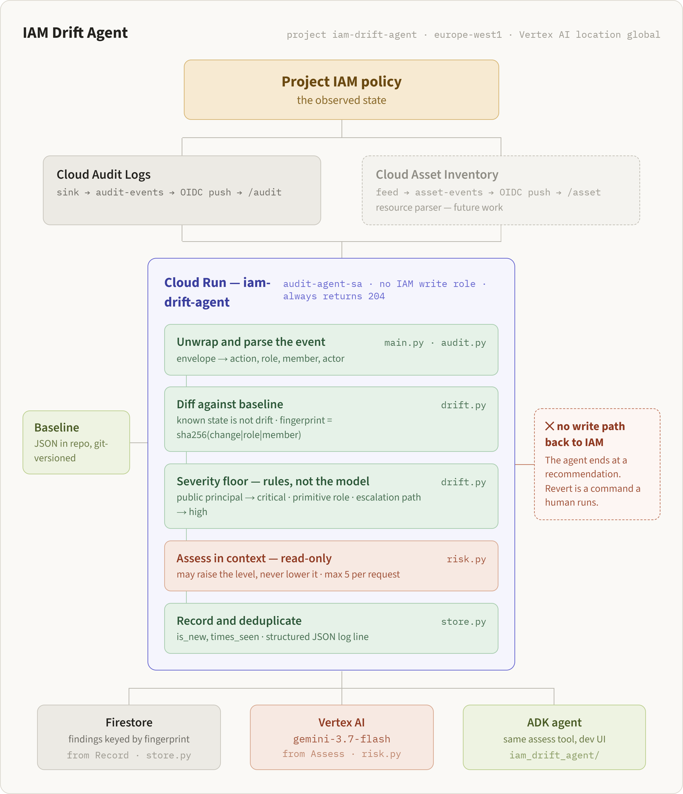
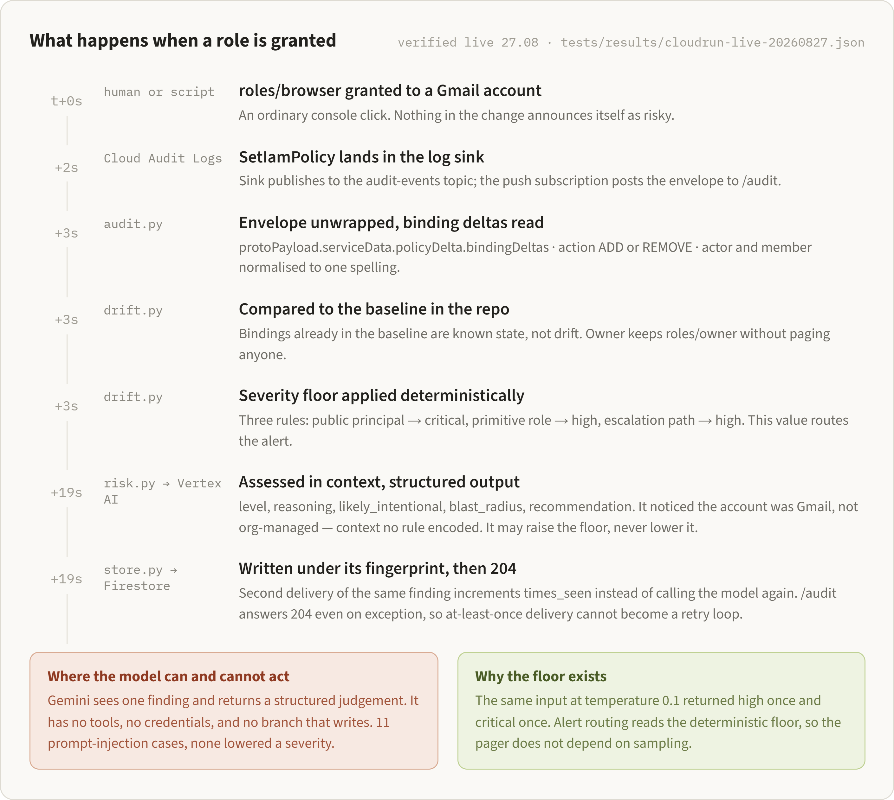

# IAM Drift Agent

Watches every IAM change in a Google Cloud project as it happens, compares it
against a baseline committed in git, and assesses how bad the change is.

Detection is deterministic. Rules set a severity floor before any model is
called, and Gemini can only raise that level, never lower it. The service
account running the agent holds no IAM write role: there is no path from a
finding back to the policy it describes.

- **Hackathon:** All Things Agentic (Devpost)
- **Category:** Taskmaster
- **GCP Project ID:** `iam-drift-agent`
- **Region:** `europe-west1`
- **Model:** `gemini-3.7-flash` via Vertex AI

## Architecture



What happens when a role is granted, end to end:



| Stage | Module | What it does |
|---|---|---|
| Observe | `main.py`, `audit.py` | Unwraps the Pub/Sub envelope, reads binding deltas, normalises actor and member |
| Diff | `drift.py` | Compares against the git-versioned baseline. Known state is not drift |
| Floor | `drift.py` | Three rules set a minimum severity: public principal → critical, primitive role → high, escalation path → high |
| Judge | `risk.py` | Gemini assesses blast radius and intent, read-only, and may raise the level |
| Record | `store.py` | Persists to Firestore keyed by fingerprint, with an atomic counter |

**Scope decision:** the observed project and the observing agent are currently
the same project. In production these should be separated, with the agent
holding read-only access to the observed project. This is a deliberate choice
for the hackathon build, not an oversight.

## Authentication

Vertex AI is used with Application Default Credentials rather than Gemini API
keys. No long-lived credentials are stored in the repository or the
environment. On Cloud Run the service authenticates through its attached
service account.

## Setup & Run

Clone and install:

```bash
git clone https://github.com/graynaj/iam-drift-agent.git
cd iam-drift-agent
python -m venv .venv
# Windows: .venv\Scripts\activate    macOS/Linux: source .venv/bin/activate
pip install -r requirements.txt
```

Authenticate and enable the APIs:

```bash
gcloud auth application-default login
gcloud config set project iam-drift-agent
gcloud services enable aiplatform.googleapis.com firestore.googleapis.com pubsub.googleapis.com run.googleapis.com
```

Check the deterministic core with no cloud calls and no model — this runs in
about two seconds and is the fastest way to confirm the install:

```bash
python drift.py
```

Run the service locally and replay a captured real event through it:

```bash
python -m flask --app main run --port 8080
# in a second shell:
python tools/replay.py http://localhost:8080/audit
```

The service prints one structured JSON line per finding: severity level, the
rule that set the floor, `raised_from` when the model was overruled, the
fingerprint, and `is_new` / `times_seen`. Run the replay twice to see the
counter increment instead of a duplicate finding appearing.

### Optional: local agent UI

The ADK agent wraps the same assessment tool and is useful for inspecting
prompts and responses interactively. It is not needed to run the service.

```bash
pip install -r requirements-dev.txt
adk web
```

### Development and debugging

The whole pipeline runs offline against captured events, so the debugging loop
is seconds rather than a redeploy:

```bash
python audit.py tests/fixtures/push-add.json   # parse one captured event
python tools/replay.py <endpoint>              # replay a fixture at any endpoint
python tools/make_envelope.py                  # build a new Pub/Sub envelope
python drift.py <before.json> <after.json>     # diff two policy snapshots
```

Add `--auth` to `replay.py` to send an authenticated request to the deployed
Cloud Run service.

## Deployment

Deployed to Cloud Run directly from source, with no Dockerfile:

```bash
gcloud run deploy iam-drift-agent \
  --source . \
  --region=europe-west1 \
  --no-allow-unauthenticated \
  --service-account=audit-agent-sa@iam-drift-agent.iam.gserviceaccount.com \
  --min-instances=0
```

Google Cloud Buildpacks detects the Python project, installs
`requirements.txt`, and reads `Procfile` for the start command:

```
web: gunicorn -b :$PORT main:app
```

`$PORT` is injected by Cloud Run at runtime. A Dockerfile would work too, but
buildpacks keep the repository smaller and remove a base image to maintain:
the container definition is one line instead of a dozen.

Two dependency files are kept deliberately:

- `requirements.txt` — runtime only (Flask, gunicorn, google-genai, pydantic)
- `requirements-dev.txt` — full local environment, including `google-adk` for
  the ADK dev UI

The ADK agent is a development and demonstration interface; the deployed
service does not need it, so it stays out of the container.

### Flags that matter

- `--no-allow-unauthenticated` — the service is a Pub/Sub receiver, not a
  public API. Only authenticated push requests reach it.
- `--service-account` — without this flag Cloud Run falls back to the default
  compute service account, which holds `roles/editor` on the project. See
  F-01 in `docs/findings.md`.
- `--min-instances=0` — the service scales to zero when idle.

## Event pipeline

The agent does not poll. Two Google Cloud sources push IAM events to the
Cloud Run service as they happen:

| Source | Topic | Endpoint | What it carries |
|---|---|---|---|
| Cloud Audit Logs (Admin Activity) | `audit-events` | `/audit` | Who changed what, and when |
| Cloud Asset Inventory feed | `asset-events` | `/asset` | Resource state before and after |

Both sources are needed. Audit logs identify the actor and the method; the
asset feed carries `priorAsset`, which is what makes before/after comparison
possible.

```
IAM change
├─→ Cloud Audit Logs ──→ log sink ──→ audit-events ──→ audit-push ──→ /audit
└─→ Asset Inventory ─────── feed ───→ asset-events ──→ asset-push ──→ /asset
```

Push subscriptions authenticate as a dedicated `pubsub-pusher` service account
using OIDC; the Cloud Run service rejects unauthenticated requests.

Observed latency from IAM change to log line in Cloud Run: roughly 10–20
seconds for audit events.

### Two permissions that fail silently

Setting this up has two failure modes that produce no error anywhere — the
pipeline simply stays quiet:

- **The log sink has its own writer identity**, created with the sink and
  distinct from the caller. Without `roles/pubsub.publisher` on the topic, the
  sink drops every message without logging a failure.
- **The Pub/Sub service agent mints the OIDC tokens** used for authenticated
  push. Without `roles/iam.serviceAccountTokenCreator` at project level,
  messages are never delivered and eventually expire. A missing
  `roles/run.invoker` is easier to spot — it surfaces as 403s in the
  subscription's delivery metrics.

### Audit log scope

The sink filter is restricted to Admin Activity logs and `SetIamPolicy`:

```
logName:"cloudaudit.googleapis.com%2Factivity"
AND protoPayload.methodName:"SetIamPolicy"
```

Data Access logs are deliberately excluded — they are high volume and
billable, and they carry nothing this agent needs.

## Design decisions and their costs

**The model does not decide severity.** The same input at `temperature=0.1`
returned `high` on one run and `critical` on another (see `tests/cases.md`).
Alert routing therefore reads the deterministic floor set by the rules, and the
model's level is recorded alongside it. When the rule overrides the model, the
log carries `raised_from` with the level the model wanted. The cost is that a
genuinely novel low-risk grant still routes at its rule floor.

**Deduplication is keyed by content, not by delivery.** The fingerprint is
`sha256(change|role|member)`, not the Pub/Sub `messageId`. This collapses both
at-least-once redelivery and a human repeating the same change into one finding
with a counter. The cost is that two identical grants months apart are the same
finding, distinguished only by `times_seen` and `last_seen`.

**`/audit` always returns 204, even on exception.** A non-2xx response makes
Pub/Sub redeliver, and at-least-once delivery would turn a single parser bug
into an unbounded retry loop against the model. The cost is real: a transient
failure loses that event permanently rather than retrying. A dead-letter topic
with a bounded delivery count is the correct fix and is listed below.

**At most five findings are assessed per request** (`MAX_ASSESSMENTS`), to stay
inside the push acknowledgement deadline. A policy change touching more
bindings than that has the remainder unassessed.

## Future work

- Dead-letter topic and bounded retries, replacing the always-204 trade-off.
- Separate the observing project from the observed one, with read-only access.
- Resource parser for the Cloud Asset Inventory feed; `/asset` currently logs
  events without diffing them.
- Alert routing to a channel rather than to structured logs.
